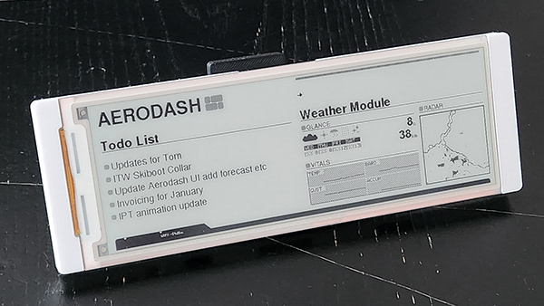
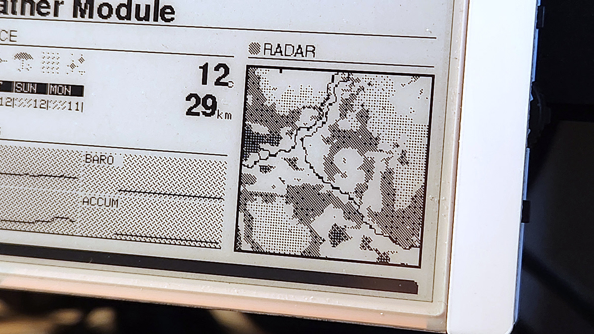
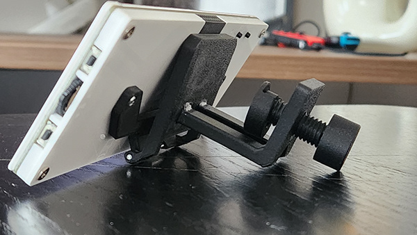

# AeroDashboard

An ESP32-S3 e-paper dashboard that displays live weather and a Todoist task list side by side on a 5.79" 792×272 monochrome display. The weather panel shows current conditions, a dithered radar image from the Turkish Meteorology service, wind/pressure stats, and a 6-hour history graph, while the task panel fetches and renders your Todoist inbox in real time. Configuration is handled entirely through a JSON file on the device filesystem — no recompilation needed to change WiFi credentials, API keys, or location.

## Setup

1. Copy `data/config.json.example` to `data/config.json` and fill in your credentials
2. Set your device IP and OTA password in `platformio.ini`
3. Flash with PlatformIO: `pio run -t upload`

## Hardware

- [Elecrow CrowPanel ESP32-S3 5.79" E-Paper](https://www.elecrow.com/crowpanel-5-79-epaper-hmi-display.html)
- Dual SSD1683 e-paper controllers (792×272, black/white)

## Dependencies

Managed automatically by PlatformIO: GxEPD2, Adafruit GFX, ArduinoJson, TJpg_Decoder, NTPClient.
